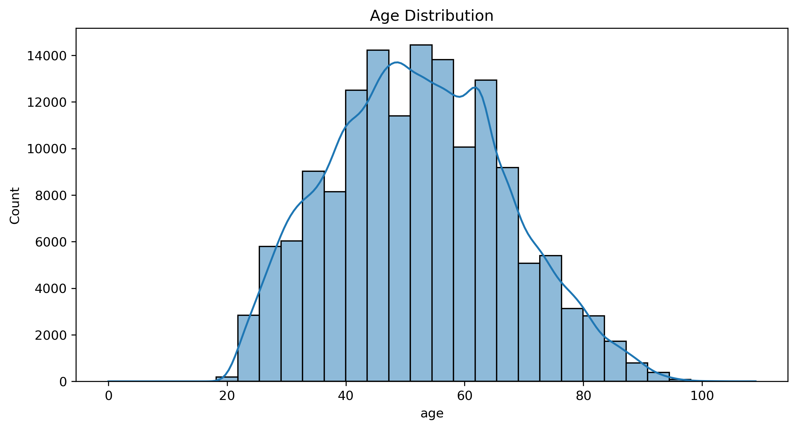
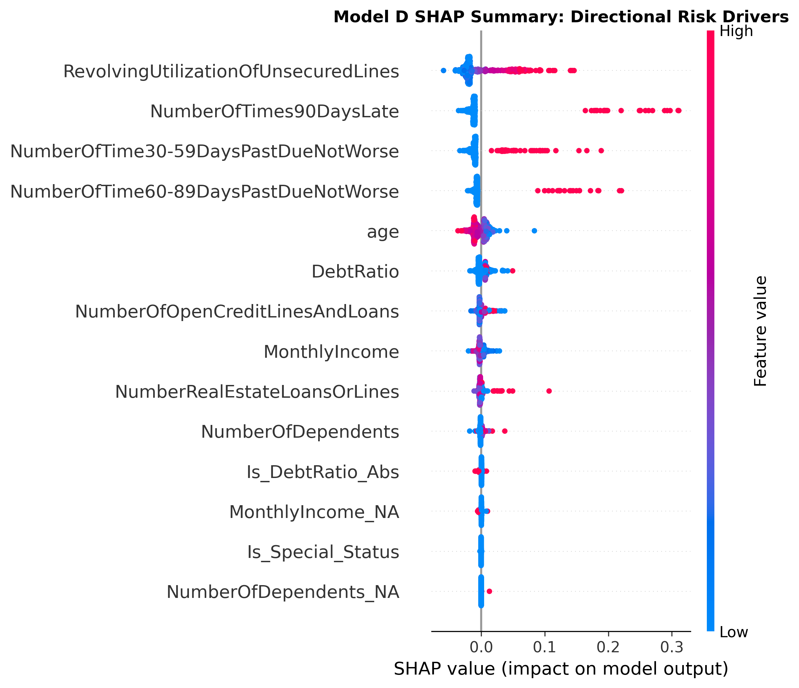
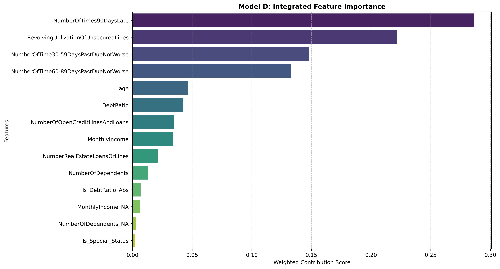
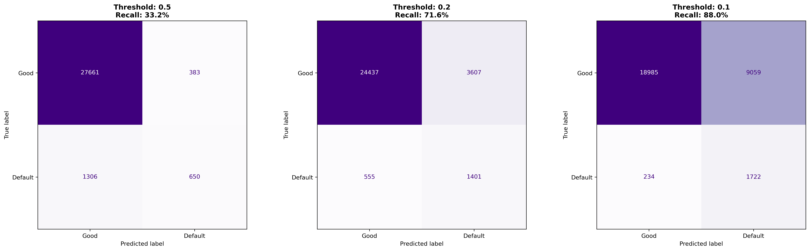
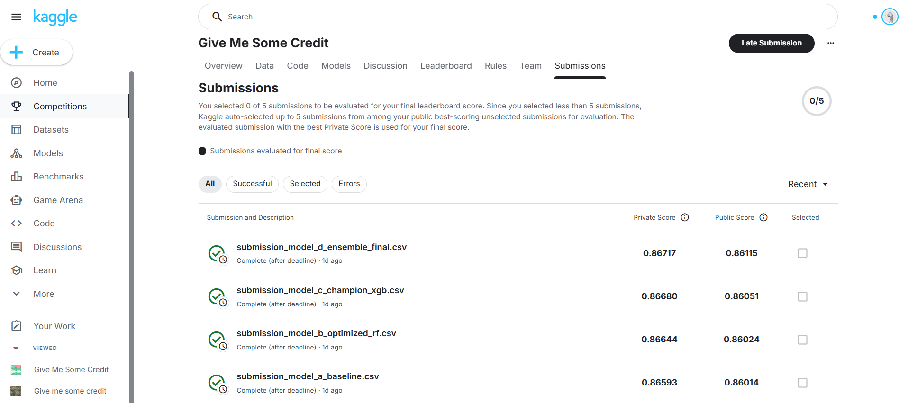

# Credit Risk Scoring & Regulatory Audit
> **End-to-end scoring engine focusing on ML interpretability and OSFI/IFRS 9 compliance.**

---

## 🎯 Project Impact
Developed a robust credit engine reaching **AUC: 0.867**. This project solves the **"ML Black Box"** problem by bridging high-performance modeling with strict financial regulatory transparency.

## ⚖️ The Core Problem
In regulated banking, accuracy isn't enough. We must ensure:
* **Logical Consistency**: No counter-intuitive relationships in the model.
* **Auditability**: Providing clear "adverse action reasons" for credit denials.
* **Monotonicity**: Ensuring risk factors (e.g., Utilization) align with economic reality.

---

## 🔍 Step 1: Data Integrity & Visual Inspection
Before modeling, I conducted a rigorous exploratory audit to ensure the dataset's demographic distributions and feature relationships align with banking reality.

> **Audit Insight**: Validated that feature variances and distributions are representative of the target lending population, identifying non-linear trends early in the pipeline.

---

## 🛠️ Step 2: Regulatory Audit & Interpretability
To meet **OSFI/IFRS 9** transparency requirements, I implemented a dual-layer audit using SHAP values and Integrated Feature Importance.

* **SHAP Audit**: Deconstructs individual predictions into transparent, feature-level contributions.
* **Logic Validation**: Leveraged **Spearman Rank Correlation** to ensure key drivers (e.g., Age, Utilization) maintain variable monotonicity.

---

## 📈 Step 3: Strategic Risk Calibration (Quantitative Audit)
The final stage involves calibrating the model to the bank's specific **Risk Appetite**.

> **Audit Insight**: By performing threshold sensitivity analysis, we balance the **Opportunity Cost** (Type I Error) against **Capital Risk** (Type II Error), providing a data-driven decision tool for the Credit Policy Committee.
> ---

## 🏆 External Validation: Official Benchmark Score
While local validation ensures model logic, final performance was verified on the unseen private test set of the "Give Me Some Credit" benchmark.

> **Performance Note**: Achieved a **Private AUC of 0.867** (top tier ranking), demonstrating the model's generalization capability on out-of-sample data. This high accuracy serves as the foundation upon which the regulatory audit layer is built.

---

## 💻 Tech Stack
* **Modeling**: `SQL`, `XGBoost`, `Random Forest`, `Scikit-learn`
* **Audit & Interpretation**: `SHAP`, `SciPy (Spearman)`, `Matplotlib`
